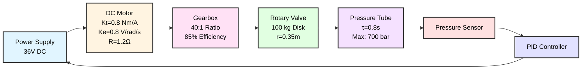
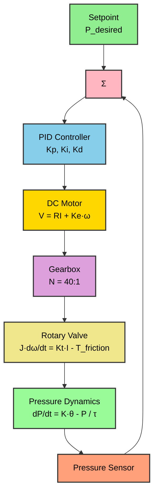
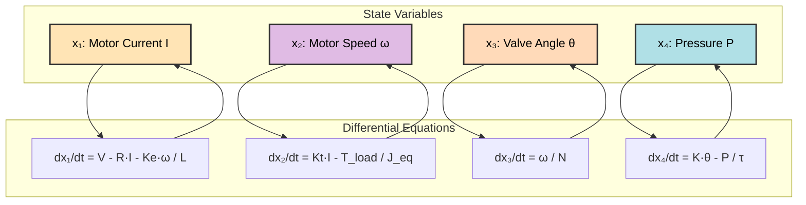
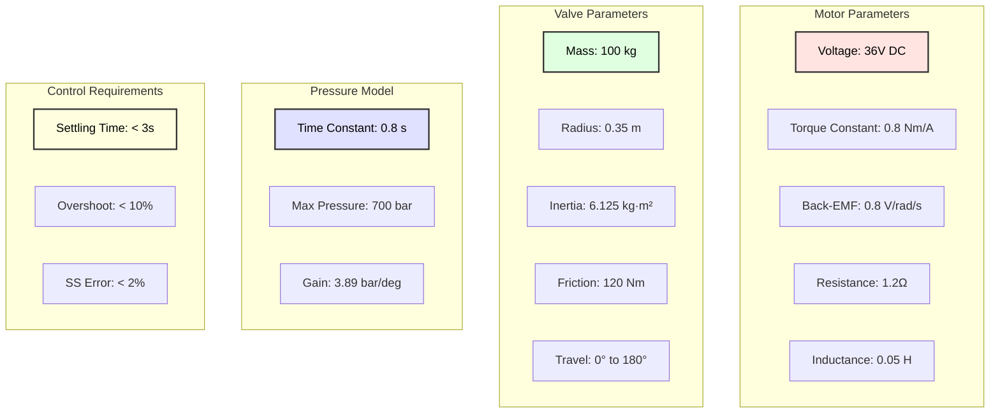
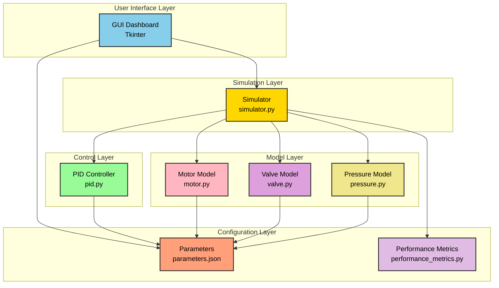
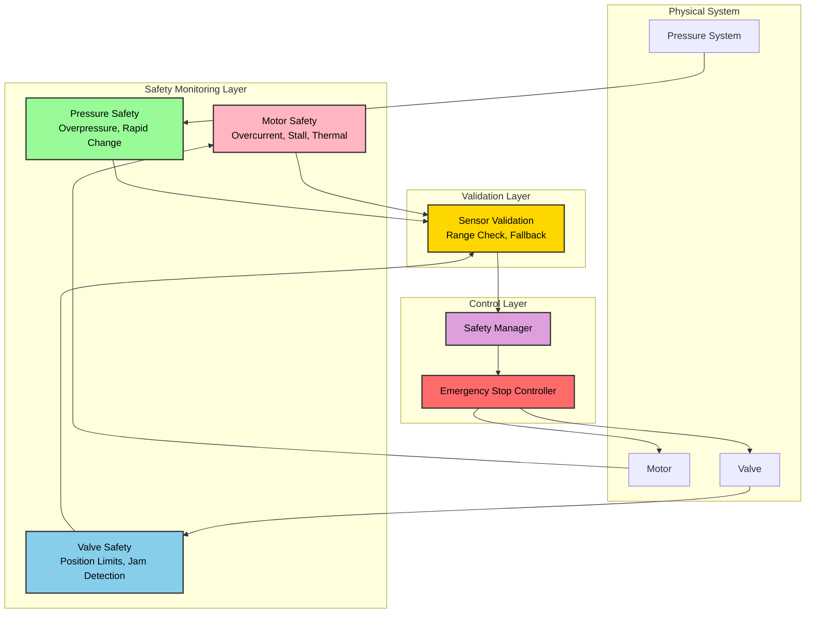

# Industrial Rotary Valve Pressure Control System

## Overview

This project implements a complete closed-loop pressure control system for an industrial pressurized tube using a rotary valve driven by a DC motor through a gearbox.

## System Description

The system consists of:
- **DC Motor**: 36V motor with gearbox (40:1 ratio, 85% efficiency)
- **Rotary Valve**: 100 kg solid disk valve with 180° angular travel
- **Pressure Tube**: Industrial tube with first-order pressure dynamics
- **PID Controller**: Closed-loop feedback control for pressure regulation

## System Architecture

### Industrial System Block Diagram



### Closed-Loop Control System



### 4th-Order State-Space Model



### Physical System Components




## Project Structure

```
pressure_regulation/
├── models/              # Physical system models
│   ├── motor.py        # DC motor electrical/mechanical dynamics
│   ├── valve.py        # Rotary valve mechanics
│   └── pressure.py     # Tube pressure dynamics
├── control/            # Control algorithms
│   └── pid.py          # PID controller implementation
├── simulation/         # Simulation engine
│   └── simulator.py    # 4th-order system simulator
├── gui/                # Graphical user interface
│   └── dashboard.py    # Tkinter-based dashboard
├── config/             # Configuration files
│   └── parameters.json # System parameters
├── utils/              # Utility modules
│   └── performance_metrics.py  # Performance analysis
├── main.py             # Main entry point
├── requirements.txt    # Python dependencies
└── README.md          # This file
```

### Software Architecture Diagram



### Data Flow Architecture

The system follows this execution flow:

1. **User Input**: User sets pressure setpoint via GUI
2. **Initialization**: GUI initializes simulator with system parameters
3. **Simulation Loop**: 
   - Simulator requests state derivatives from physical models
   - Models return dx/dt based on current states
   - PID controller computes control voltage based on pressure error
   - Simulator integrates using `scipy.integrate.solve_ivp`
   - GUI updates real-time displays
4. **Performance Analysis**: Metrics module computes performance statistics
5. **Results Display**: GUI shows final performance report to user


## Installation

1. **Clone or download this repository**

2. **Install Python dependencies:**
   ```bash
   pip install -r requirements.txt
   ```

3. **Verify installation:**
   ```bash
   python -c "import numpy, scipy, matplotlib; print('Dependencies OK')"
   ```

## Usage

Run the application:
```bash
python main.py
```

The GUI dashboard will open, allowing you to:
- Set desired pressure setpoint
- Start/stop simulation
- Monitor real-time pressure, valve angle, and motor current
- View live pressure graph

## Control Requirements

The PID controller is designed to meet:
- **Settling time**: < 3 seconds
- **Overshoot**: < 10%
- **Steady-state error**: < 2%
- **Disturbance rejection**: ±50 bar step disturbance

## System Parameters

All parameters are defined in `config/parameters.json`:
- Motor: 36V, Kt=0.8 Nm/A, Ke=0.8 V/(rad/s), R=1.2Ω
- Valve: 100 kg, radius=0.35m, friction=120 Nm
- Pressure: τ=0.8s, max=700 bar
- Gear: 40:1 ratio, 85% efficiency

## Mathematical Model

The system is a **4th-order nonlinear dynamic system**:

**State variables:**
- x₁: Motor current (I)
- x₂: Motor speed (ω)
- x₃: Valve angle (θ)
- x₄: Pressure (P)

**Governing equations:**
1. Electrical: `V = R·I + Ke·ω`
2. Mechanical: `J_eq·(dω/dt) = Kt·I - T_load`
3. Kinematics: `dθ/dt = ω / gear_ratio`
4. Pressure: `dP/dt = (K·θ - P) / τ`

## Performance Validation

The system automatically computes:
- Settling time
- Percent overshoot
- Steady-state error
- Stability confirmation
- Disturbance recovery time

## Safety Architecture

This system implements industry-standard safety monitoring suitable for aerospace/avionics applications.



## Safety Considerations

### Safety Monitoring Subsystems

1. **Motor Safety Monitor**
   - **Overcurrent Protection**: Triggers at >30A (instantaneous)
   - **Stall Detection**: Triggers at >25A for >0.5s
   - **Thermal Protection**: I²t monitoring with 60s time constant
   - **Sensor Validation**: Rejects readings outside [-1A, 35A]

2. **Pressure Safety Monitor**
   - **Overpressure Protection**: Critical at >700 bar, warning at >650 bar
   - **Underpressure Protection**: Triggers at <0 bar
   - **Rapid Change Detection**: Triggers at >200 bar/s (potential rupture/leak)
   - **Sensor Validation**: Rejects readings outside [-10 bar, 750 bar]

3. **Valve Safety Monitor**
   - **Position Limits**: Enforces 0° to 180° range
   - **Velocity Limits**: Triggers at >90°/s
   - **Jam Detection**: Detects commanded motion with no actual movement
   - **Sensor Validation**: Rejects readings outside [-10°, 190°]

4. **Emergency Stop Controller**
   - **Immediate Shutdown**: Motor voltage → 0V in <0.5s
   - **Valve Hold**: Maintains current position during stop
   - **Manual Reset Required**: Operator intervention needed after safety fault
   - **State Preservation**: Logs fault reason and system state

### Sensor Validation

All sensors implement validation with fallback behavior:

| Sensor | Valid Range | Fallback Value | Failure Threshold |
|--------|-------------|----------------|-------------------|
| Pressure | -10 to 750 bar | 100 bar (safe mid-range) | 3 consecutive out-of-range |
| Motor Current | -1 to 35 A | 0 A (motor off) | 3 consecutive out-of-range |
| Valve Position | -10° to 190° | 90° (mid-position) | 3 consecutive out-of-range |

**Fallback Strategy:**
1. First out-of-range reading → Use last valid reading, log warning
2. Second consecutive → Continue using last valid, increase warning level
3. Third consecutive → Sensor declared failed, use configured fallback value

## Fault Cases & Mitigation Strategies

| Fault Type | Detection Method | Mitigation Strategy | Recovery |
|------------|------------------|---------------------|----------|
| **Motor Overcurrent** | Current >30A | Emergency stop, cut motor power | Manual reset after fault cleared |
| **Motor Stall** | Current >25A for >0.5s | Emergency stop, prevent thermal damage | Manual reset, check mechanical jam |
| **Motor Thermal Limit** | I²t accumulator >1.2× rated | Emergency stop, cooldown required | Automatic after thermal decay |
| **Overpressure** | Pressure >700 bar | Emergency stop, valve to safe position | Manual reset, check pressure relief |
| **Rapid Pressure Change** | dP/dt >200 bar/s | Emergency stop, potential rupture | Manual inspection required |
| **Valve Position Limit** | Angle <0° or >180° | Emergency stop, mechanical stop engaged | Manual reset, check position sensor |
| **Valve Jam** | Commanded motion but no movement | Emergency stop, mechanical fault | Manual inspection, clear obstruction |
| **Sensor Failure** | 3 consecutive out-of-range | Use fallback value, log error | Sensor replacement, manual reset |

## Logging

The system implements structured logging with severity levels:

- **DEBUG**: Detailed diagnostic information
- **INFO**: Normal operation events (setpoint changes, mode transitions)
- **WARN**: Abnormal conditions that don't require shutdown (approaching limits)
- **ERROR**: Fault conditions requiring emergency stop

**Log Files:**
- `logs/pressure_control.log`: All events (rotating, 10MB max, 5 backups)
- `logs/errors.log`: ERROR level and above only

**Logged Events:**
- Control saturation (PID output at limits)
- Motor stall warnings
- Sensor faults and fallback activation
- Safety violations and emergency stops
- System state transitions

## Testing

### Running Tests

**Install test dependencies:**
```bash
pip install pytest pytest-cov pytest-mock
```

**Run all tests with coverage:**
```bash
pytest
```

**Run specific test categories:**
```bash
# Safety-critical tests only
pytest -m safety

# Unit tests only
pytest -m unit

# Integration tests only
pytest -m integration
```

**Run specific test files:**
```bash
pytest tests/test_motor_safety.py -v
pytest tests/test_sensor_validation.py -v
pytest tests/test_safety_integration.py -v
```

**Generate coverage report:**
```bash
pytest --cov=. --cov-report=html
# Open htmlcov/index.html in browser
```

### Test Structure

```
tests/
├── conftest.py              # Test fixtures and configuration
├── test_motor_safety.py     # Motor safety monitor tests
├── test_sensor_validation.py # Sensor validation tests
└── test_safety_integration.py # Safety manager integration tests
```

**Coverage Goals:**
- Safety modules: >90% coverage
- Validation modules: >85% coverage
- Control modules: >80% coverage

## Technology Stack

- **Language**: Python 3.8+
- **Numerical**: NumPy, SciPy
- **Visualization**: Matplotlib
- **GUI**: Tkinter
- **Integration**: scipy.integrate.solve_ivp

## Author

Industrial Pressure Control System  
Date: 2026-02-18

## License

Educational/Research Use
